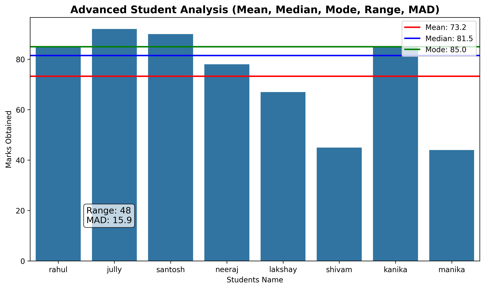

# Student-Data-Analysis
A Python Project Analyzing Student  Marks
# 📊 Advanced Student Data Analysis & Visualization

Welcome to my first professional Data Analytics portfolio project! This project demonstrates how to perform core statistical analysis on raw data and transform those insights into a meaningful, beautiful visual chart using Python.

---

## 🎯 Project Overview
In this project, I created a dataset consisting of student names and their respective marks. Using Python's powerful data science libraries, I calculated the key metrics of central tendency and dispersion, and then mapped them onto a custom-styled bar chart.

## 🛠️ Statistical Concepts Covered

To understand the dataset completely, the following 5 statistics were calculated:

1. *Mean (Average):* The central value of the data, calculated by adding all marks and dividing by the total number of students. 
   * Formula: $\Sigma x / n$
2. *Median (Middle Value):* The exact middle score after sorting the marks from lowest to highest. It helps find the midpoint without being affected by extreme scores.
3. *Mode (Most Frequent):* The value that appears most often. (In this dataset, 85 is the mode as multiple students scored it).
4. *Range (Spread):* The difference between the highest marks and the lowest marks. It shows the total spread of the scores.
   * Formula: $\text{Maximum} - \text{Minimum}$
5. *MAD (Mean Absolute Deviation):* The average distance between each data point and the mean. It shows how much the students' marks deviate from the class average.

---

## 🚀 Tech Stack & Libraries Used
* *Python 3* - The core programming language.
* *Pandas* - For structuring the raw dictionary data into a clean, Excel-like DataFrame table.
* *Matplotlib* - For building the base visual layout and drawing custom mathematical reference lines.
* *Seaborn* - For modern, advanced styling and adding a clean color palette gradient to the bars.

---

## 📉 Project Visualization Output
Below is the advanced graph generated directly by the Python script. It features a custom coolwarm gradient bar chart along with dedicated horizontal markers for *Mean (Red Line), **Median (Blue Line), and **Mode (Green Line)*, as well as a dedicated text box for Range and MAD:



---

## 💻 The Python Source Code
Here is the exact clean script I wrote and executed to achieve this analysis:

```python
import numpy as np
import pandas as pd
import matplotlib.pyplot as plt
import seaborn as sns

# 1. Creating the Dataset
data = {
    'name': ['rahul', 'jully', 'santosh', 'neeraj', 'lakshay', 'shivam', 'kanika', 'manika'], 
    'marks': [85, 92, 90, 78, 67, 45, 85, 44]
}
df = pd.DataFrame(data)

# 2. Statistical Calculations
mean_val = df['marks'].mean()
median_val = df['marks'].median()
mode_val = df['marks'].mode()[0]  
range_val = df['marks'].max() - df['marks'].min()
mad_val = (df['marks'] - mean_val).abs().mean()

# 3. Plotting Configuration
plt.figure(figsize=(11, 6))
sns.barplot(x='name', y='marks', data=df, palette='coolwarm')

# 4. Adding Trend Lines
plt.axhline(mean_val, color='red', linestyle='--', linewidth=2, label=f"Mean: {mean_val:.1f}")
plt.axhline(median_val, color='blue', linestyle='-.', linewidth=2, label=f"Median: {median_val:.1f}")
plt.axhline(mode_val, color='green', linestyle=':', linewidth=2, label=f"Mode: {mode_val:.1f}")

# 5. Adding Data Box for Dispersion Metrics
info_text = f"Range: {range_val}\nMAD: {mad_val:.1f}"
plt.text(0.5, 15, info_text, fontsize=12, bbox=dict(facecolor='white', alpha=0.7, boxstyle='round'))

# 6. Labels and Details
plt.title('Advanced Student Analysis (Mean, Median, Mode, Range, MAD)', fontsize=14, fontweight='bold')
plt.xlabel('Students Name')
plt.ylabel('Marks Obtained')
plt.legend(loc='upper right')

# 7. Saving and Rendering
plt.savefig('complete_data_analysis.png', dpi=300, bbox_inches='tight')
plt.show()
